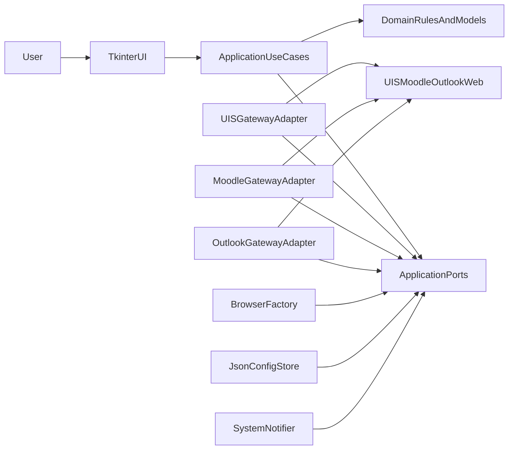

# Smart Sniper CZU

Smart Sniper CZU is a desktop automation tool for CZU student workflows:
- **UIS Sniper** for exam slot monitoring and auto-enrollment.
- **TC Sniper** for Moodle reservation monitoring/booking.
- **Enrolled Terms** for aggregated UIS + Moodle reservation overview.

## Architecture

The project follows an Onion-style layered architecture:
- `smart_sniper/domain` - entities and pure business rules.
- `smart_sniper/application` - use cases and ports (contracts).
- `smart_sniper/infrastructure` - Selenium adapters, config storage, notifier, browser factory.
- `smart_sniper/presentation` - UI adapters (Tkinter-facing layer).

Entrypoint: `main.py` (legacy launch via `uis_sniper_gui.py` is still possible).

### Architecture Diagram



## Requirements (Linux)

- Python 3.10+
- Brave Browser (default browser target for Selenium)
- Tkinter package (`python3-tk`)
- Python dependencies (see `requirements.txt`):
  - `selenium`
  - `webdriver-manager`
  - `pytest`

## Local Setup

```bash
python3 -m venv .venv
source .venv/bin/activate
pip install -r requirements.txt
```

## Run

```bash
python3 main.py
```

## Tests

```bash
pytest -q
python -m compileall .
```

## CI/CD

Workflow file: `.github/workflows/ci-cd.yml`

- **CI (`verify`)**
  - Install dependencies.
  - Run `pytest -q`.
  - Run `python -m compileall .`.

- **CD (`build_deb`)**
  - Build Debian package via `scripts/build_deb.sh`.
  - Upload `.deb` as workflow artifact.

- **Release (`release`)**
  - Triggered on tags matching `v*`.
  - Publishes `.deb` to GitHub Release assets.

## Build Debian Package Locally

```bash
bash scripts/build_deb.sh 0.1.0
```

Resulting file:
- `build/deb/smart-sniper-czu_<version>_all.deb`

## Runtime Notes

- Configuration file on Linux:
  - `~/.config/smart-sniper-czu/smart_sniper_config.json`
- Outlook/Moodle authentication can require manual MFA/SAML/OAuth steps.
- Do not close the browser window while a sniper workflow is running.

## Disclaimer

Use at your own risk.
